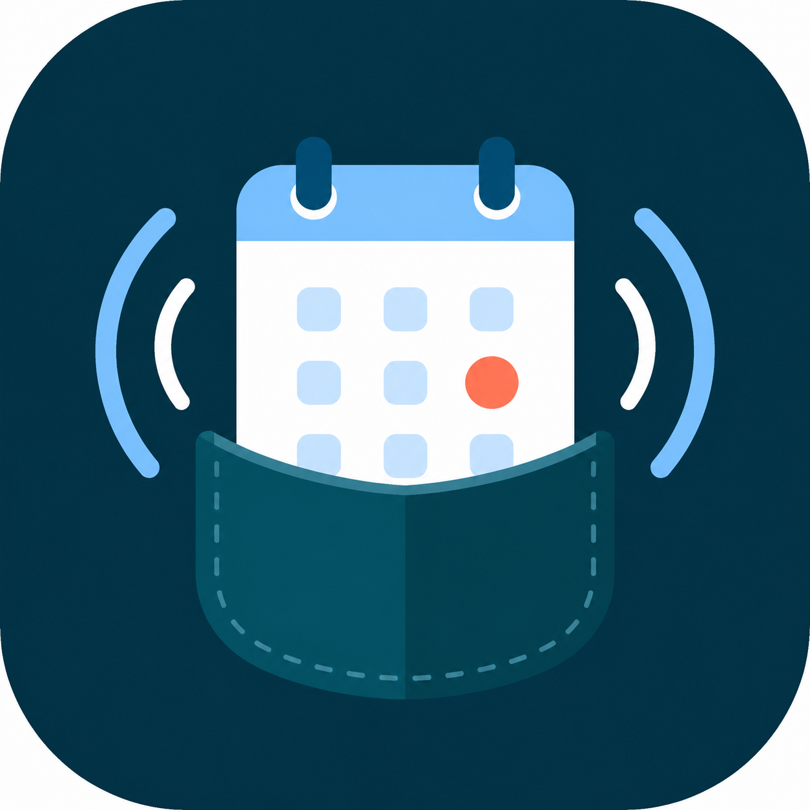

# Pocket CalDAV



Pocket CalDAV is a small self-hosted CalDAV server for personal calendars.
It keeps deployment simple by combining:

- Radicale for standards-compliant CalDAV serving.
- FastAPI management endpoints under `/api/*`.
- Filesystem-backed attachment storage with automatic cleanup.

It is designed for Apple Calendar and for Android devices that include a native CalDAV account provider. Many stock Android builds do not include native CalDAV; Pocket CalDAV stays standards-compliant but cannot add missing OS sync-provider support on the phone.

The project is intentionally compact: one Python server file, one Dockerfile,
and persistent filesystem storage that is easy to back up.

## Quick Start on Windows

```powershell
cd D:\projects\pocket-caldav
py -m venv .venv
.\.venv\Scripts\Activate.ps1
python -m pip install --upgrade pip
python -m pip install -r requirements.txt
python server.py cli
python server.py
```

The first run creates:

- `data\users.json` for CalDAV usernames and passwords. It starts empty unless `CALDAV_USERS` is set.
- `data\api_key.txt` with a generated management API key.
- `data\settings.json` with attachment cleanup settings.
- `data\collections` for Radicale calendar data.
- `data\attachments` for uploaded event attachments.

Use the guided CLI to create the first user and calendar. CalDAV passwords are stored as bcrypt htpasswd hashes. For real deployment, set explicit environment variables or manage credentials carefully on the server.

## Quick Start with Docker

Copy the environment template and edit the public domain:

```bash
cp .env.example .env
nano .env
```

Start the service:

```bash
docker compose up -d --build
docker compose logs -f caldav
```

By default, Compose binds the service to `127.0.0.1:5232` on the host and stores all server data in the named volume `caldav-data`. Put Caddy or nginx in front of it for HTTPS, then set `PUBLIC_BASE_URL` in `.env` to that external HTTPS origin.

Minimal Caddy example:

```text
calendar.example.com {
    request_body {
        max_size 30MB
    }
    reverse_proxy 127.0.0.1:5232
}
```

Run the guided CLI inside the container when you need to create calendars or change saved cleanup settings:

```bash
docker compose exec caldav python server.py cli
```

If `CALDAV_API_KEY` is empty, the server generates one on first startup and stores it in the data volume. Read it with:

```bash
docker compose exec caldav cat /data/api_key.txt
```

If `CALDAV_USERS` is empty, create CalDAV users with the guided CLI. You can still set `CALDAV_API_KEY` or `CALDAV_USERS` in `.env` when you want fixed values managed by environment variables.

For a direct non-proxied local test, set `HOST_BIND=0.0.0.0` in `.env` and restart the container. Do not expose plain HTTP publicly with real CalDAV passwords.

## Guided Server CLI

Run this on the server:

```powershell
python server.py cli
```

The menu can:

- Show configured users, calendars, and cleanup settings.
- Create or update a CalDAV user.
- Delete an old user by either migrating that user's calendars and managed attachments to another user or permanently deleting them.
- Create a calendar for a user.
- Set the attachment cleanup TTL and cleanup interval.
- Run attachment cleanup immediately.

`python server.py` and `python server.py serve` both start the CalDAV server.

## Configuration

For a normal Docker deployment behind Caddy/nginx, the only value users must edit is `PUBLIC_BASE_URL`.

Docker Compose reads these values from `.env`:

| Variable | User must set? | Default/example | Purpose |
| --- | --- | --- | --- |
| `PUBLIC_BASE_URL` | Yes, for production | `https://calendar.example.com` | External HTTPS origin written into generated attachment URLs. Set this to your real calendar domain. |
| `HOST_BIND` | Usually no | `127.0.0.1` | Host bind address for the Docker port mapping. Keep `127.0.0.1` when using Caddy/nginx on the same server. |
| `HOST_PORT` | Usually no | `5232` | Host-side port used by Caddy/nginx to reach the container. Change only if `5232` is already used locally. |
| `ALLOWED_HOSTS` | No | empty | Optional comma-separated Host allowlist. Empty derives the public host from `PUBLIC_BASE_URL` and also allows local health checks. |
| `CALDAV_API_KEY` | No | empty | Leave empty to auto-generate `/data/api_key.txt`. Fixed values must be at least 32 characters. |
| `CALDAV_USERS` | No | empty | Leave empty and create users with `python server.py cli`. Set only if you want users/passwords managed by `.env`. |
| `ATTACHMENT_TTL_DAYS` | No | `365` | Attachment cleanup TTL. If set, it overrides the value saved by the CLI. |
| `CLEANUP_INTERVAL_SECONDS` | No | `3600` | Attachment cleanup interval. If set, it overrides the value saved by the CLI. |
| `MAX_ICS_BYTES` | No | `1048576` | Maximum management API event body size. |
| `MAX_ATTACHMENT_BYTES` | No | `26214400` | Maximum stored attachment size. |
| `MAX_REQUEST_BYTES` | No | `31457280` | Default request body limit for other routes, including direct CalDAV traffic. |

The Compose file sets these internal container values automatically; users normally should not add them to `.env`:

| Variable | Compose value | Purpose |
| --- | --- | --- |
| `DATA_DIR` | `/data` | Persistent server data inside the Docker volume. |
| `HOST` | `0.0.0.0` | Container listen address. The host exposure is controlled by `HOST_BIND`. |
| `PORT` | `5232` | Container listen port. The host exposure is controlled by `HOST_PORT`. |

Without Docker, the script reads these environment variables directly:

| Variable | Required? | Default | Notes |
| --- | --- | --- | --- |
| `DATA_DIR` | No | `./data` | Set this to a backed-up production path if running outside Docker. |
| `HOST` | No | `127.0.0.1` | Keep loopback behind a reverse proxy; use `0.0.0.0` only for direct local testing. |
| `PORT` | No | `5232` | Application listen port. |
| `PUBLIC_BASE_URL` | Recommended for production | request base URL | Set to the external HTTPS origin so attachment URLs are stable and client-visible. |
| `ALLOWED_HOSTS` | No | derived from `PUBLIC_BASE_URL` | Optional comma-separated Host allowlist. |
| `CALDAV_API_KEY` | No | generated in `data/api_key.txt` | Optional fixed management API key, at least 32 characters. |
| `CALDAV_USERS` | No | empty | Optional fixed users. Prefer the guided CLI for user setup. |
| `ATTACHMENT_TTL_DAYS` | No | saved setting or `365` | Overrides `data/settings.json` when present. |
| `CLEANUP_INTERVAL_SECONDS` | No | saved setting or `3600` | Overrides `data/settings.json` when present. |
| `MAX_ICS_BYTES` | No | `1048576` | Maximum management API event body size. |
| `MAX_ATTACHMENT_BYTES` | No | `26214400` | Maximum stored attachment size. |
| `MAX_REQUEST_BYTES` | No | `31457280` | Default request body limit for other routes. |

`CALDAV_USERS` accepts either comma-separated `user:password` pairs or JSON:

```powershell
$env:CALDAV_USERS = "main:replace-main-password"
$env:CALDAV_USERS = '{"main":"main-password"}'
```

When `HOST=0.0.0.0` or `HOST=::`, `PUBLIC_BASE_URL` is required unless `ALLOW_REQUEST_BASE_URL=true` is explicitly set for local testing. `PUBLIC_BASE_URL` must use HTTPS unless `ALLOW_INSECURE_PUBLIC_BASE_URL=true` is explicitly set.

Run a single process/worker for this script. Radicale and the management API share the same filesystem storage and coordinate with Radicale's storage lock.

## Calendar URLs

Local development base URL:

```text
http://127.0.0.1:5232
```

One-user, multiple-calendar layout:

```text
http://127.0.0.1:5232/main/work/
http://127.0.0.1:5232/main/personal/
http://127.0.0.1:5232/main/shared/
```

Separate-user layout:

```text
http://127.0.0.1:5232/work/default/
http://127.0.0.1:5232/personal/default/
http://127.0.0.1:5232/shared/default/
```

No default calendars are created automatically. Create the users and calendars you actually need with `python server.py cli` or the management API.

For Apple Calendar on iOS/macOS:

1. Open Calendar account settings.
2. Add a CalDAV account.
3. Server: `https://calendar.example.com` or `http://127.0.0.1:5232` for local testing.
4. Username/password: one of the users from `data\users.json` or `CALDAV_USERS`.
5. If manual URL entry is available, use one of the full calendar URLs above.

For Android:

1. Use the built-in CalDAV account provider if your Android/OEM build includes one.
2. Server: `https://calendar.example.com` or the full calendar URL.
3. Username/password: matching CalDAV credentials.

Use HTTPS in production. CalDAV uses Basic authentication here, so cleartext HTTP exposes credentials on the network.

## Management API

All `/api/*` calls require:

```text
X-API-Key: <value from CALDAV_API_KEY or data\api_key.txt>
```

Create a calendar:

```powershell
Invoke-RestMethod `
  -Method Post `
  -Uri http://127.0.0.1:5232/api/calendars `
  -Headers @{ "X-API-Key" = "<api-key>" } `
  -ContentType "application/json" `
  -Body '{"owner":"main","calendar":"work","display_name":"Work"}'
```

Create or update an event:

```powershell
$ics = @"
BEGIN:VCALENDAR
VERSION:2.0
PRODID:-//Pocket CalDAV//EN
BEGIN:VEVENT
UID:event-001
DTSTAMP:20260526T090000Z
DTSTART:20260527T100000Z
DTEND:20260527T110000Z
SUMMARY:Example Event
END:VEVENT
END:VCALENDAR
"@

Invoke-RestMethod `
  -Method Put `
  -Uri http://127.0.0.1:5232/api/calendars/main/work/event-001 `
  -Headers @{ "X-API-Key" = "<api-key>" } `
  -ContentType "text/calendar" `
  -Body $ics
```

Upload an attachment:

```powershell
curl.exe `
  -X POST `
  -H "X-API-Key: <api-key>" `
  -F "file=@C:\path\to\file.pdf" `
  http://127.0.0.1:5232/api/calendars/main/work/event-001/attachments
```

Delete an event:

```powershell
Invoke-RestMethod `
  -Method Delete `
  -Uri http://127.0.0.1:5232/api/calendars/main/work/event-001 `
  -Headers @{ "X-API-Key" = "<api-key>" }
```

Manually run attachment cleanup:

```powershell
Invoke-RestMethod `
  -Method Post `
  -Uri http://127.0.0.1:5232/api/cleanup `
  -Headers @{ "X-API-Key" = "<api-key>" }
```

## Production Notes

- Put the service behind an HTTPS reverse proxy such as Caddy or nginx.
- Set `PUBLIC_BASE_URL` to the external HTTPS origin so event attachment URLs are usable from clients.
- Keep the reverse proxy request body limit at or below `MAX_REQUEST_BYTES`.
- In Docker, back up the `caldav-data` volume. Without Docker, store `data` somewhere backed up and protected by filesystem permissions.
- Keep `CALDAV_API_KEY` and CalDAV passwords secret.
- Start with one worker process. If you need multi-process scaling, move management writes behind a single writer or use Radicale-native operations instead of direct filesystem writes.

## License

Pocket CalDAV is released under the MIT License. See [LICENSE](LICENSE).
